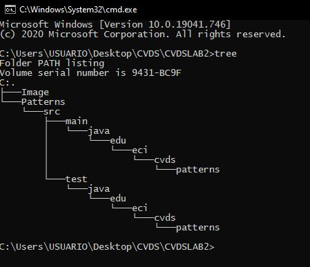

# CVDSLAB2

## La Herramienta Maven
### Cual es su mayor utilidad?

Manejar la creación, los informes y la documentación de un proyecto a partir de una pieza central de información.

Consultado en [Apache Maven](https://maven.apache.org/)

### Fases de maven:

Las fases de Maven son las siguientes:
1. Validar: Revisar si toda la información necesaria para el constructor esta disponible.
2. Compilar: Compilar el código base.
3. Compilar-test: Compilar los tests del código base.
4. Test: Compilar pruebas de Unidad.
5. Package: Paquete del código compilado en el formato seleccionado (jar, entre otros).
6. Test de Integración: Procesa y despliega el paquete si necesita correr pruebas de integración.
7. Instalación: Instala el paquete en un repositorio local.
8. Despliegue: Copiar el paquete en un repositorio local.

### Ciclos de vida de la construccion:

Maven se basa en el concepto central de un ciclo de vida de construcción. Lo que esto significa es que el proceso para construir y distribuir un artefacto en particular (proyecto) está claramente definido. Para la persona que crea un proyecto, esto significa que solo es necesario aprender un pequeño conjunto de comandos para construir cualquier proyecto Maven, y el POM se asegurará de que obtenga los resultados que desea. Hay tres ciclos de vida de compilación integrados: `default`, `clean`, `site`.

- **Default**: El ciclo de vida default maneja la implementación de su proyecto, gestionando la construcción y despliegue del proyecto.
- **Clean**: El ciclo de vida clean maneja la limpieza del proyecto, eliminando todos los archivos generados en el proceso de construcción y despliegue.
- **Site**: El ciclo de vida site maneja la creación de la documentación del sitio de su proyecto.

### Para que sirven los puglins en Maven?

Es donde se realiza parte de la "acción real", los plugins se utilizan para: crear archivos jar, crear archivos war, compilar código, código de prueba unitaria, crear documentación del proyecto, y así sucesivamente. Casi cualquier acción que pueda pensar en realizar en un proyecto se implementa como un complemento de Maven.

### Que es y para que sirve el repositorio central de Maven:

Son cientos o quizás miles de librerías que podemos utilizar para múltiples propósitos y Maven se encarga de aprovechar los recursos que ya existen de la mejor forma para lograr los objetivos propuestos. Es un repositorio que contiene cientos de librerías constantemente actualizadas por sus creadores y sirve para que todos los usuarios puedan buscar versiones recientes o antiguas de un código dado y agregarlas a su proyecto de manera automática (sin que el usuario tenga que hacer más que definir sus dependencias).

## Crear un proyecto con Maven

Creamos el proyecto desde consola con el comando:

`mvn archetype:generate`

Seleccionamos el **grupoid**, **artifactid**, **archetypeArtifactId**

Comando: `Tree`

## Ajustar algunas configuraciones en el proyecto

## Compilar y Ejecutar

### parametro Package:

El objetivo del parámetro package es empaquetar el código compilado en su formato distribuible, como un JAR.

